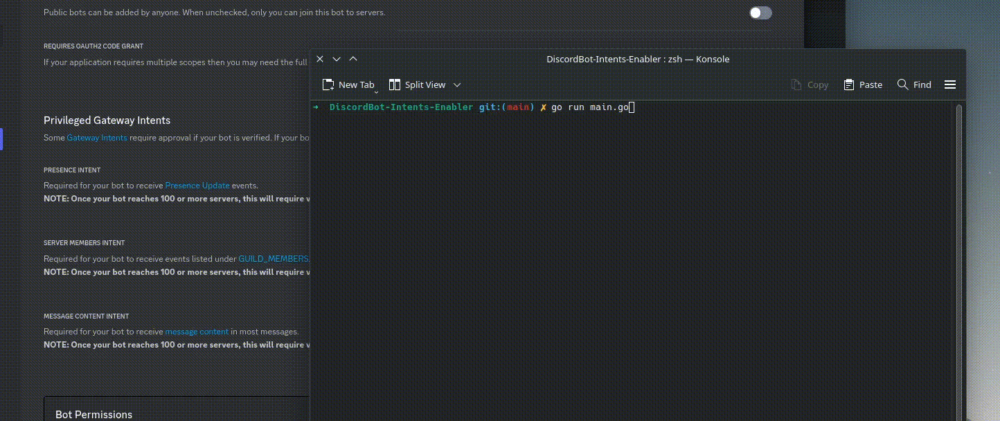

# Golang's DiscordBot Intents Enabler

## Introduction

This Golang program enables Discord bots to access all Intents by simply providing the bot's token.

## Preview



## Requirements

To utilize this program, ensure you have the following installed on your system:

- Golang [Installation Guide](https://go.dev)
- Basic familiarity with running commands in a terminal

Golang is compatible with various operating systems including Linux distributions, recent versions of macOS, and Windows.

## Usage

### 1. Configuration

Begin by modifying the `config.yaml` file located in the program's root directory using your preferred text editor.

Update the `bot_token` field with your bot's token.

### 2. Running the Program

Once you have successfully installed Golang on your system, execute the following command in your terminal:

```sh
user@os:$ go run main.go
```

### 3. Verification on the Developer Portal

That's it! Your bot now has all Intents enabled. You can verify this on the Discord Developer Portal.